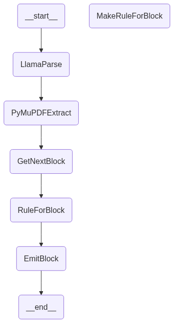

# An overly specific PDF parser

What started as a desire to turn a generic PDF into structured data that is:

1. Split into chapters, displayable in the browser, preserving visually identity
2. Chunkable, embeddings generating, and usable for RAG
3. Backed by a collaborative editor

Iterated into something fairly specific for one visually complex PDF with a lot of learnings along the way for next time.

1. LLM-based PDF parsers have made a lot of progress in extracting content _mostly_ in order, but the latest efforts have largely been optimized to extract meaning for things like RAG. This means that preserving header orders, or captions to images, or general styling isn't fully there. I mitigated this by zipping the LLM based output with pymupdf, which extracts styles as well - and used these styles to autocorrect heading and paragraph assignments.

2. ProseMirror is a great format for a live editor (of which I chose the Tiptap editor thats built on it for a nicer interface) - but complicated for normal, non-editor rendering. Initially, I thought I might store directly in ProseMirror JSON, extending the schema as needed, and then implementing the render methods in that schema to display in a non-editable view. But this added a ton of unneeded complexity. I settled on an intermediary format that is prosemirror flavored. I can convert it to prosemirror and back for an editable view, but create my own view-only components with less restrictions. Editing was moved to out of scope.

That said, this setup was really cool, because `doc_server` is a FastAPI server that serves up a ProseMirror document, and inside `tiptap` is a minimal tiptap (prose mirror) editor that read from the server. This meant that while I was using the ProseMirror schema as my storage format, I could see the document convert in real time, which gives an oppurtunuity to loop in feedback to the generation (if it looks right or not). I eventually killed the live viewer when I changed schemas, but I think its useful to explore in the future - especially, how the output could be used to automatically inform and potentially correct LLM suggestions of how a certain block should render.

This whole process is orchestrated by LangGraph.

There is a rule registry that contains rules for converting llamaparse (LLM/OCR pdf parser) and pymupdf input to the output format. These rules are defined by LLM. Each time an item is processed, the existing rules are checked - if none match, a new one is proposed.

This is a work in process.

## Local testing window (from the old live viewer)

There is a FastAPI that serves up ProseMirror JSON.
`cd doc_server && uv run uvicorn main:app --reload`

And an editor that can display it
`cd tiptap/live_viewer && pnpm run dev`

## Future directions

I had issues with the quality and consistency of data coming from LlamaParse, all in all solid for extracting meaning, but I think I would try Marker by DataLab or MinerU (a full model that can recognize patterns across an entire document) for a future iteration.

Additionally, much of the custom extraction was to handle specificly formatted callout boxes. I think this could be generalized by also taking into account shapes and colors that pymupdf reports are on a given page and reconciling them into more generic sections, looking for patterns. Alternatively, tools like prodigy and spaCy could be used to potentially provide human in the loop identification of custom elements. Or, I could specifically prompt an LLM to describe any custom sections and find patterns in how to extract them from the pymupdf input.
