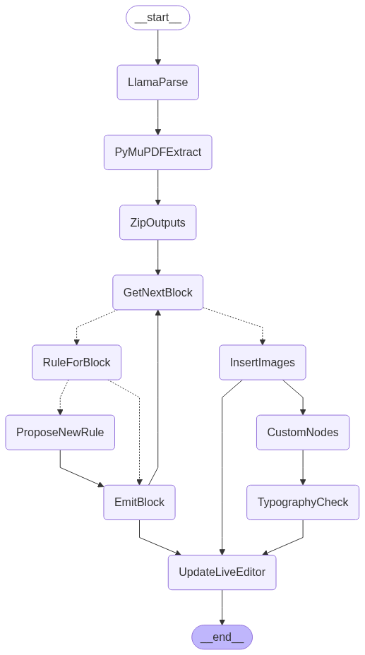

# PDF to ProseMirror

Convert a PDF to ProseMirror schema so that it can be editable in web browser.

This process is orchestrated by LangGraph.

Given that the desired output is ProseMirror, first we need to get the precise schema that ProseMirror nodes are required to be in. Since this project uses some custom TipTip extensions, its under `tiptap_schema_extractor` - where instantiating an editor allows dumping the schema of all the allowed nodes.

Next that schema is converted into Python classes for each node type.

There is a rule registry that contains rules for converting llamaparse and pymupdf input to the ProseMirror/Tiptap nodes. These rules are defined by LLM. Each time an item is processed, the existing rules are checked - if none match, a new one is proposed.

This is a work in process.

